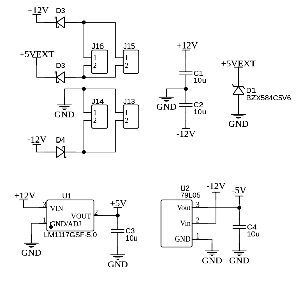
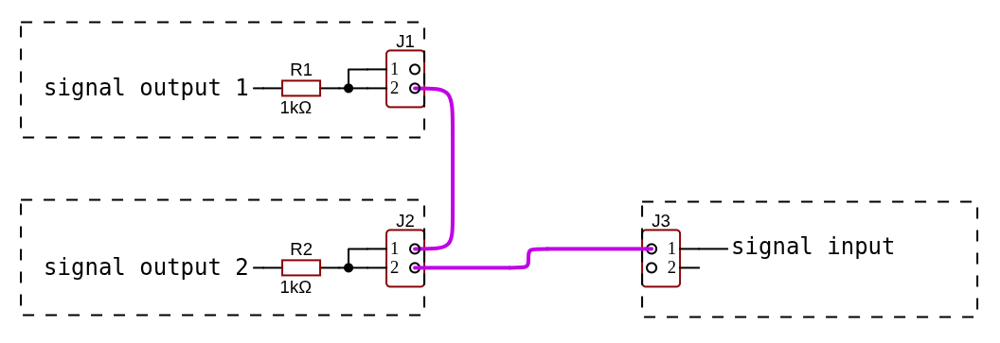

# Electrical Specifications

The MICRORACK system operates within these electrical parameters to ensure module compatibility and safe operation.

## Power Supply

MICRORACK modules are placed on the breadboard and use the following **order of voltage rails for power**:

| Rail | Voltage | Purpose |
|------|---------|---------|
| V12+ | +12V | Positive power supply |
| V5+ | +5V | Aux positive power supply |
| GND | 0V | Ground reference |
| V12- | -12V | Negative power supply |

> Middle section pins of the breadboards are not used for either power distribution by MICRORACK Specification and is reserved for extending I/O signals or prototyping.

- **Voltage tolerance**: ±10% on all power rails
- **Ripple**: Up to 200 mV Vpp

Each power rail requires at least 2 pins (on both sides of the module), and it must be directly connected to each other to power adjacent modules between two breadboards.

### Power Consumption

- **Maximum current per rail**: 100 mA (on any individual power rail)
- **Current ripple**: ≤ 50 mA Ipp (on any individual power rail)

Typical modules consume 10–30 mA depending on design complexity. It is recommended to minimize power consumption as much as possible.

### Power Quality and Regulation

The power rails are inherently noisy. Modules should either include on-board voltage regulation or use circuits that are tolerant to power supply fluctuations.

> ⚠️ **Do not use the *V5+ rail* as a voltage reference.** Instead, derive a local regulated supply using an on-board regulator. The *V5+ rail* is intended for powering digital logic and LED indicators only.

### Hot-Swap

When hot-swapping a module with power enabled, the power sequencing order is not guaranteed since all connector pins have equal length.

Modules must be designed to briefly withstand the following transient conditions:

| Condition | Effect |
|-----------|--------|
| GND and V12- disconnected | Up to -7V on V5+ |
| GND and V12+ disconnected | Up to +17V on V5+ |
| GND disconnected | Up to 24V between V12+ and V12- |

In all scenarios, current is limited by the module's own consumption.

If the V5+ rail powers sensitive components, it is recommended to add overvoltage protection, such as a 5.6V Zener diode, to clamp transient voltages during hot-swap events.

### Reverse Protection

There are no mechanical constraints preventing a module from being inserted upside down. Because of that modules **must include reverse polarity protection** (e.g., Schottky diodes) and be designed to withstand the following voltages when inserted incorrectly:

| Rail | Voltage (reversed) |
|------|-------------------|
| V12+ | Up to -24V |
| V5+  | Up to -17V |
| V12- | Up to +24V |

!!! warning "Important"

    A reverse-inserted module must not short-circuit the power rails under any circumstances!

*Example of a module power schematic with protections and regulators for internal ±5V rails.*

## Signal I/O

### Maximum Ratings

Absolute maximum ratings for signal inputs and outputs are as follows:

- **Input voltage range**: -25V to +25V (on any signal input)
- **Output voltage range**: Must not exceed the power supply rails (i.e., output must remain within -12V to +12V)

### Signal Levels

- **Bipolar signals** (audio, bipolar CV): ±5V nominal (10 Vpp)
- **Unipolar signals** (envelopes, gates, triggers, clock, unipolar CV): 0V to +5V nominal (0V to +8V is also acceptable)

### Pitch CV

Pitch control voltage follows the **1V/octave** standard.

### Logic Signals

Triggers, gates, and clock signals use the following thresholds:

- **High level**: ≥ 3.5V
- **Low level**: ≤ 0.7V

Timing requirements:

- **Minimum trigger width**: 100 µs (1 ms recommended)
- **Maximum rise/fall time**: 1 ms

!!! tip "Tip"

    It is recommended to use a Schmitt trigger for logic inputs.

### I/O Amount

It is recommended to put at least two pins for each signal input and sum them together. Similarly, it is recommended to put at least two pins for each signal output and duplicate the signal to both.

## Impedance Specifications

### Input Impedance

- **Minimum**: > 10 kΩ
- **Recommended**: ~100 kΩ

For V/Oct pitch inputs, an input impedance of approximately 100 kΩ is mandatory to prevent signal level drop and pitch detuning.

!!! warning "Warning"

    Avoid excessively high input impedance (> 100 kΩ), as it increases susceptibility to noise pickup.

### Output Impedance

- **Maximum**: < 1 kΩ
- **Recommended**: < 100 Ω

Alternative output configurations are permitted:

- **Passive summing**: Use 1 kΩ output impedance with multiple directly connected pins. This allows outputs from different modules to be summed by connecting them together.

- **Wired-OR**: Use open-emitter or diode-coupled outputs with multiple directly connected pins. This enables wired-OR logic between module outputs.

### Output Protection

All outputs must include current limiting to protect against accidental misconnection. A module output must withstand direct connection to any power rail (from -12V to +12V) without damage.

---

*For mechanical specifications, see [Mechanical](mechanical.md).*
