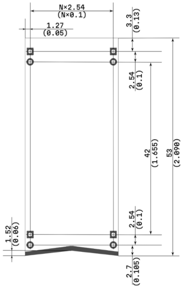

# Mechanical Specifications

To ensure compatibility between modules and accessories, all mechanical aspects must adhere to the following specifications.

## Dimensions and Outlines

> [PCB Outline Template for EasyEDA](https://oshwlab.com/microrack/microrack-template-1.0)

The **height of the module is 2090 mil (53 mm)**. If the module has connectors on the top, it is allowed to increase the height by 400 mil (10 mm).

The **width of modules is not fixed.** To increment the module width use formula:

> (N+1) * 100 mil (2.54 mm)

Where N+1 is the number of 100 mil (2.54 mm) breadboard lines the module occupies.

> **Example**
>
> Module with a width of 7 lines will have a width of `6+1 * 100 = 700 mil (17.5 mm)`

To easily distinguish between top and bottom of the modules, a **symmetrical triangular cutout** is made at the bottom. Height or "depth" of cutout is 60 mil (1.52 mm).

## Power Contacts

Each module equipped with power contacts at the bottom layer of the board. There are two pairs of contacts on each corner of the module. They power and mount the module in a breadboard.

**Male pin headers with a 100 mil (2.54 mm) pitch** are used for power contacts. The -12V and GND contacts are located at the bottom corners of the board, while the +12V and +5V contacts are located at the top corners.

> **Tip**
>
> For specific use cases and firmer connection of interfaces and bigger cables double row male pin headers can be used.

The distance between the centers of the **inner pins** is 1655 mil (42 mm). The distance from the center of the **outer pins** to the edges of the board is 130 mil (3.3 mm).

> It is recommended to use 0.9 mm holes for standard male pin headers

The offset of the outline from the center of the contact to the side is 50 mil (1.27 mm).

## Module Interconnection

Color coded male pin headers are used for connecting modules to each other. Blue ones for inputs, red ones for outputs. Black pins usually serve utility functions like chaining, power extension, stylus voltage or ground.

> **I/O Placement**
>
> It is recommended to place **inputs on the left side and outputs on the right side**, at the top of the module or on the edge of the board.

## Components Height

The **height of components on the bottom layer** should not exceed 100 mil (2.54 mm).

## Electrical specifications

*For electrical specifications, see [Electrical](../electrical/).*
